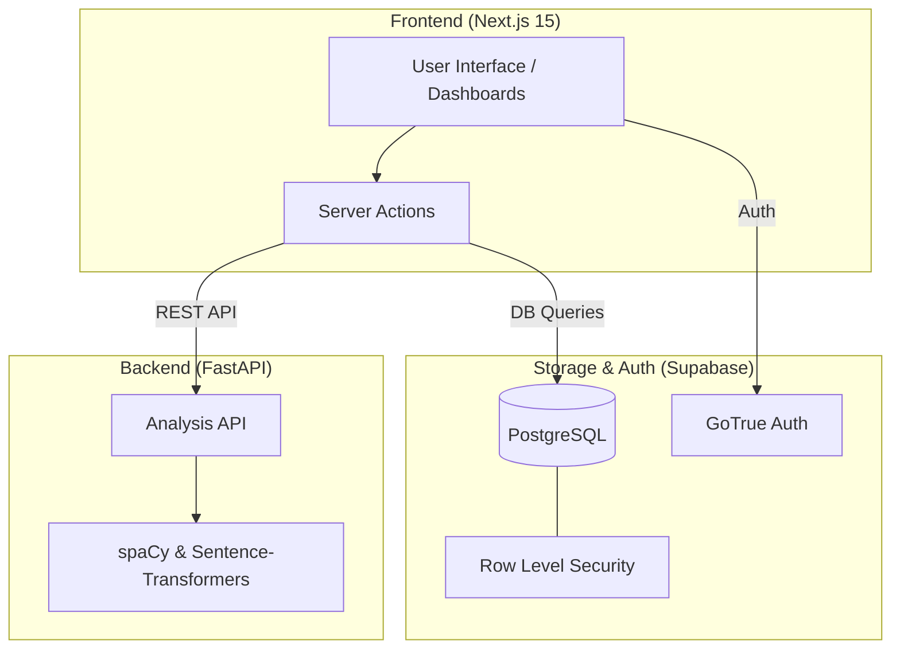

# 🎯 ApplyIQ — AI-Powered Job Tracker & Resume Analyzer

[](https://apply-iq-nu.vercel.app/)
[](https://apply-iq-backend.onrender.com)
[](https://nextjs.org/)
[](https://fastapi.tiangolo.com/)
[](https://supabase.com/)

**ApplyIQ** is a premium, state-of-the-art platform designed to revolutionize the job search experience. By combining deep AI-driven resume analysis with a seamless application tracking system, ApplyIQ helps candidates bridge the gap between their current skills and their dream roles.

---

## 🚀 Key Features

- **🧠 Intelligent Resume Analysis**: Semantic matching using Sentence-Transformers to compare your resume against job descriptions with high precision.
- **📊 Skill Gap Analysis**: Automatically identifies missing skills and provides actionable suggestions for improvement.
- **🔄 Auto-Sync Skills**: Extracts skills directly from your resume and synchronizes them with your professional profile.
- **📅 Smart Application Tracking**: A modern, fluid dashboard to manage your entire job search pipeline in one place.
- **✨ Premium UI/UX**: Built with "Aurora" backgrounds, "Liquid Glass" components, and smooth Framer Motion animations for a top-tier experience.
- **🔐 Secure & Private**: Integrated with Supabase Auth and PostgreSQL with Row-Level Security (RLS) to keep your data safe.

---

## 🏗️ System Architecture

ApplyIQ follows a modern decoupled architecture, ensuring scalability and performance.



---

## 🛠️ Tech Stack

### Frontend
- **Framework**: Next.js 15 (App Router)
- **Library**: React 19
- **Styling**: Tailwind CSS v4
- **Animations**: Framer Motion
- **UI Components**: Shadcn UI (Radix UI)
- **Icons**: Lucide React

### Backend
- **Framework**: FastAPI (Python 3.10+)
- **NLP Engine**: spaCy (`en_core_web_sm`)
- **Semantic Models**: Sentence-Transformers (`all-MiniLM-L6-v2`)
- **Document Parsing**: pdfplumber, python-docx

### Database & Auth
- **Provider**: Supabase (PostgreSQL + GoTrue)
- **Realtime**: Supabase PostgREST

---

## ⚙️ Getting Started

### 1. Prerequisites
- **Node.js**: v18.0+
- **Python**: 3.10+
- **Supabase Account**: A project for Authentication and Database.

### 2. Frontend Setup
```bash
# Navigate to frontend
cd frontend

# Install dependencies
npm install

# Setup environment variables
cp .env.example .env.local
# Add your Supabase URL and Anon Key to .env.local

# Run development server
npm run dev
```
Access at: `http://localhost:3000`

### 3. Backend Setup
```bash
# Navigate to backend
cd backend

# Create & activate virtual environment
python -m venv venv
source venv/bin/activate # Windows: venv\Scripts\activate

# Install dependencies
pip install -r requirements.txt

# Download NLP model
python -m spacy download en_core_web_sm

# Run the API server
python main.py
```
Access API Docs at: `http://localhost:8000/docs`

---

## 📂 Project Structure

```text
ai-job-tracker/
├── frontend/           # Next.js 15 Application
│   ├── app/           # App Router (Pages & Layouts)
│   ├── components/    # Reusable UI Components
│   ├── lib/           # Supabase client & Utils
│   └── public/        # Static assets (icon.svg, etc.)
├── backend/            # FastAPI Python Service
│   ├── models/        # Pydantic Schemas
│   ├── services/      # NLP & Matching Logic
│   └── main.py        # API Entry Point
└── scripts/           # SQL Migration & Setup scripts
```

---

## 🤝 Contributing

We welcome contributions! Feel free to open issues or submit pull requests.

1. Fork the Project
2. Create your Feature Branch (`git checkout -b feature/AmazingFeature`)
3. Commit your Changes (`git commit -m 'Add some AmazingFeature'`)
4. Push to the Branch (`git push origin feature/AmazingFeature`)
5. Open a Pull Request

---

Developed with ❤️ by [Apurv](https://github.com/apuuuurv)

